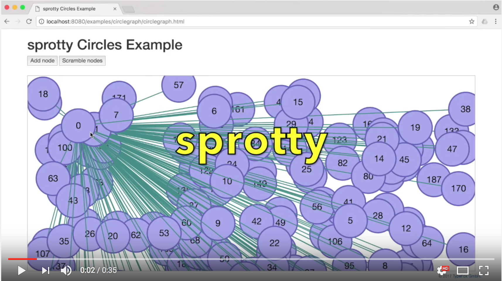

# sprotty
sprotty is a next-generation, open-source, web-based diagramming framework. Some selected features:

* fast, scalable SVG rendering that is compatible with many browsers and stylable with CSS,
* animations built into the core,
* support for a distributed runtime with a diagram client and a model server,
* a fast, reactive client architecure implemented in TypeScript,
* a Java-based server architecture,
* configuration via dependency injection,
* integration with [Xtext, the Language Server Protocol and Theia](https://github.com/TypeFox/theia-sprotty-example).

[](http://www.youtube.com/watch?v=IydM4l7WFKk "sprotty demo")

## Getting started

```
# clone the repo
git clone git@github.com:TypeFox/sprotty.git
# build sprotty client and examples
cd sprotty/client
npm install
npm run build
# build and run the sprotty server
cd ../server
./gradlew jettyRun 
# point your web browser to localhost:8080
```

For further information please consult the [wiki](https://github.com/TypeFox/sprotty/wiki).
