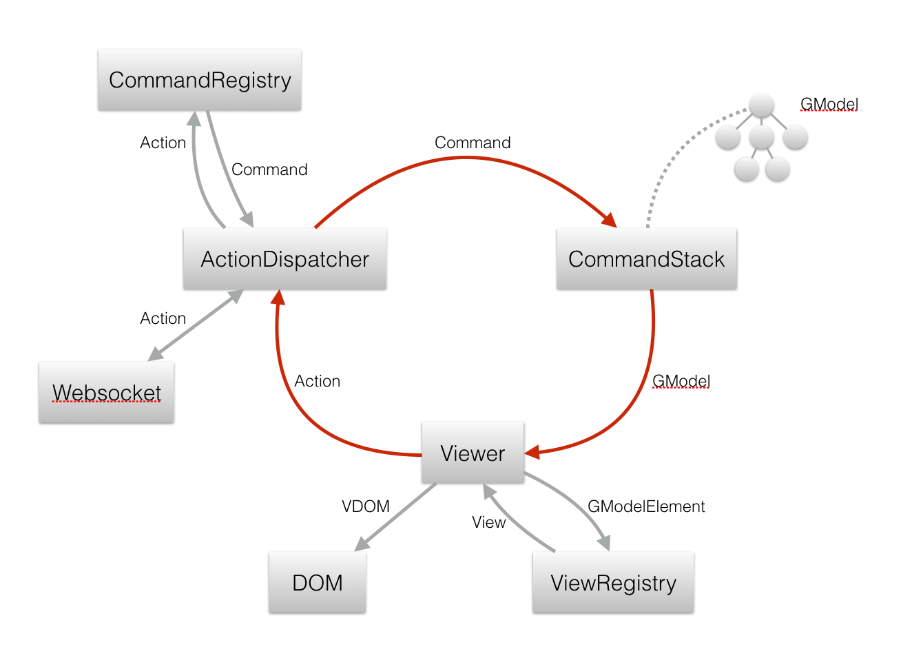

# Documentation

The base architecture is inspired by Flux and other reactive web frameworks. The key feature is a unidirectional cyclic event flow. As opposed to the classical model-view-controller pattern, the event flow is always clear, will not form cycles etc. Into the bargain, the testability should be a lot better.

## Graph Model
The diagram is stored in a graph model. All elements inherit from `GModelElement`. A `GModelElement` has a unique ID, a type to look up its `View`. The graph model is a tree, induced by the properties `parent` and `children`. The root of is always an instance of `GModelRoot`, which holds an index of the model to allow fast lookup of elements by ID.

### Behaviors
Behaviors are interfaces that describe additional data that is attached to a `GModelElement` in order to allow some interaction pattern, e.g.

- `Selectable`: An element can be selected
- `Movable`: An element can be moved.

## Actions
`Actions` describe a certain operation on the grpah model. As plain JSON objects they can be serialized and as such transported between client and server. In actions, model elements are referred to by ID.

### Action Dispatcher
The `ActionDispatcher` receives actions either from the `Viewer` or from the server. It converts them to commands using the `CommandRegistry` and passes them to the `CommandStack`.

## Commands
`Commands` correspond to `Actions` and carry the actual behavior of the operation. They have the notorious methods `execute()`, `undo()`and `redo()`, each of which take the current model and a command execution context as parameter, and return the new model or a promise for it. The latter serves to chain asynchronous commands, e.g. animations.

### Command Registry
The `CommandRegistry` is used to look up the command that corresponds to an action.
It's the user's responsibility to populate it.

### Command Stack
The `CommandStack` executes the commands it receives from the `ActionDispatcher`. It chains the promises returned by the execution methods and keeps an undo and a redo stack. It is merges the current commands with the last one, e.g. to only keep the start and end point of a move by drag operation. Once the new graph model is available, it is forwarded to the `Viewer`.

## Viewer 
The `Viewer` creates a virtual DOM from the new graph model. Builds the virtual DOM from the `Views` and uses it to patch the current DOM. The viewer is also resonsible to add event listeners and animations using its `Decorators`. 

### View
A `View` knows how to turn a graph model element and its children into a virtual DOM node.

### View Registry
The `Viewer` uses the `ViewRegistry`to look up the `View` for a graph model element using its ID.

### VNodeDecorators
`VNodeDecorators` are applied by the `Viewer` to the `View` elements, e.g. in order to register event listeners and animations.